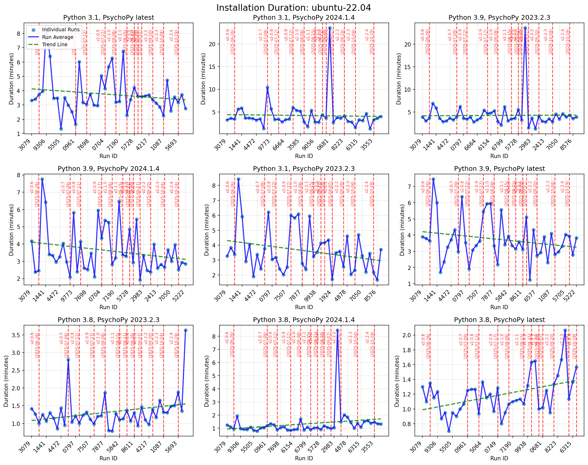
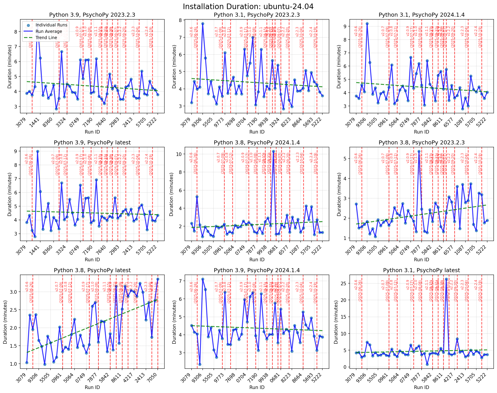

# Performance Data

## Summary Statistics

- **Total test runs**: 738
- **Unique workflow runs**: 44
- **Date range**: 2025-06-26 to 2025-10-09
- **Distinct test dates**: 29

### Installation Duration

- **Average**: 3.38 minutes
- **Median**: 3.35 minutes
- **Min**: 0.70 minutes
- **Max**: 26.25 minutes
- **Std Dev**: 2.16 minutes

### By Operating System

| OS | Test Runs | Avg Duration | Median Duration |
|---|---:|---:|---:|
| ubuntu-22.04 | 350 | 3.01 min | 2.90 min |
| ubuntu-24.04 | 388 | 3.71 min | 3.72 min |

### By Python Version

| Python Version | Test Runs | Avg Duration | Median Duration |
|---|---:|---:|---:|
| 3.1 | 233 | 4.28 min | 3.75 min |
| 3.10 | 6 | 4.68 min | 4.88 min |
| 3.8 | 250 | 1.70 min | 1.38 min |
| 3.9 | 249 | 4.19 min | 3.93 min |

### By PsychoPy Version

| PsychoPy Version | Test Runs | Avg Duration | Median Duration |
|---|---:|---:|---:|
| 2023.2.3 | 243 | 3.39 min | 3.47 min |
| 2024.1.4 | 246 | 3.39 min | 3.28 min |
| latest | 249 | 3.36 min | 3.32 min |

### Configuration Performance

**Fastest 5 configurations (by average duration)**:

| Configuration | Test Runs | Avg Duration |
|---|---:|---:|
| ubuntu-22.04, 3.8, latest | 41 | 1.18 min |
| ubuntu-22.04, 3.8, 2023.2.3 | 38 | 1.23 min |
| ubuntu-22.04, 3.8, 2024.1.4 | 41 | 1.31 min |
| ubuntu-24.04, 3.8, latest | 44 | 2.02 min |
| ubuntu-24.04, 3.8, 2023.2.3 | 43 | 2.18 min |

**Slowest 5 configurations (by average duration)**:

| Configuration | Test Runs | Avg Duration |
|---|---:|---:|
| ubuntu-24.04, 3.9, 2023.2.3 | 44 | 4.39 min |
| ubuntu-24.04, 3.9, 2024.1.4 | 42 | 4.42 min |
| ubuntu-24.04, 3.10, 2024.1.4 | 43 | 4.47 min |
| ubuntu-24.04, 3.9, latest | 44 | 4.56 min |
| ubuntu-24.04, 3.10, latest | 43 | 4.81 min |

## Visualization

### All Runs

### Averages Comparison

### ubuntu-22.04 Subplots

### ubuntu-24.04 Subplots

